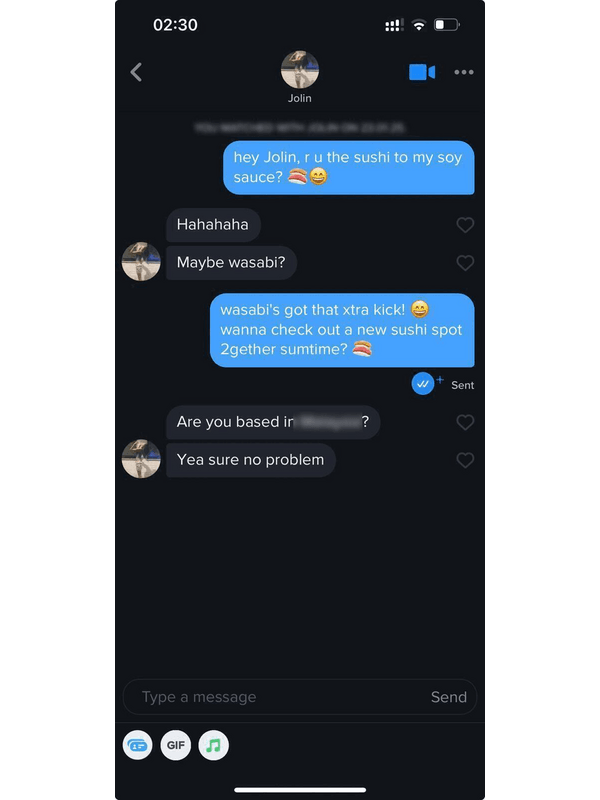

<p align="center">
    
</p>
<p align="center"><h1 align="center">TINDER-AI</h1></p>
<p align="center">
	<em><code>❯ Build your AI dating bot</code></em>
</p>
<p align="center">
	<!-- local repository, no metadata badges. --></p>
<p align="center">
	
	
	<br>
	
	
	
</p>
<br>

<p align="center">
    
</p>

## 📌 Table of Contents
- [Overview](#-overview)
- [Setup](#-setup)
- [QuickStart](#-quickstart)
- [Usage](#-usage)
  - [Session](#session)
  - [Openers](#openers)
  - [Replies](#replies)
  - [Auto-Swiping](#auto-swiping)
- [Messenger Service](#-messenger-service)
- [Proxies](#-proxies)
- [Disclaimer](#-disclaimer)

---

## 🚀 Overview
Tinder-AI is a **Tinder bot SDK** using **Selenium with undetected Chromedriver**. It provides:
- **Profile setup**
- **Proxy support**
- **Geolocation spoofing**
- **Automated swiping**
- **Chatbot integration (Openers & replies)**

Use it to build your own **AI dating assistant**.

---

## ⚙️ Setup

**Install the package**
```shell
pip install tinder-ai
```

**Create the `.env` file containing:**
```sh
# Messenger API configuration
MESSENGER_API=url_to_api

# Proxy configuration
PROXY_URL=url_to_proxy

# Facebook login credentials
FACEBOOK_EMAIL=your_fb_email
FACEBOOK_PASSWORD=your_fb_password

# Tinder Preferences
AGE_RANGE_MIN=18
AGE_RANGE_MAX=28
LOCATION_LAT=custom_latitude
LOCATION_LON=custom_longitude
DISTANCE_RANGE=40
GENDER_PREFERENCE=women
SET_GLOBAL=false

# Bot Behavior
SWIPE_LIMIT=100
```

Edit .env and fill in the required values.

---

## ⚡ QuickStart
**Note**: *You will still need a messenger api, if none is given in the `.env`. It will just use the `MockingMessengerClass`.*

```shell
python -m tinder_ai --all
```

---

## 🛠 Usage
#### Session
**Set up a session**
Setting `mock=True` will still call the messenger service but messages will **not** actually be sent.
```python
from tinder_ai import Settings, Session
from tinder_ai.services.messenger_api import MockMessengerService

settings = Settings()
messenger_service = MockMessengerService()
with Session(
	settings=settings,
	messenger_service=messenger_service
    #mock=true
) as session:
	session.login(
		method=settings.get_login_method()
	)
```

#### Openers
**Send a first message to all matches**
```python
session.handle_matches()
```

#### Replies
**Auto-reply unread messages**
```python
session.handle_unread_messages()
```

#### Auto-Swiping
**Swipe on profiles automatically**
```python
session.start_swiping()
```

---

### 🤖 Messenger Service

The Messenger Service handles **AI-generated messages** for **openers and replies**.


##### Option 1: Using an API
Plug in your own LLM service to use for messaging.
```python
messenger_service = MessengerService(
	base_url="http://0.0.0.0:8080"
)
session = Session(
	settings=settings,
	messenger_service=messenger_service
)
```

##### Option 2: Using a custom class
Inherit from the base messenger class and build your own llm wrapper.

```python
class CustomMessengerService(BaseMessengerService):
    """A custom AI Messenger Service."""

    def generate_opener(self, profile: MatchProfile) -> MessageResponse:
        """Generate a default opening message."""
        return MessageResponse(message=f"Hi {profile.name} 😊!")

    def generate_reply(
        self,
        profile: MatchProfile,
        last_messages: Optional[List[Message]] = None
    ) -> MessageResponse:
        """Generate a chatbot-style reply based on conversation history."""
        if last_messages:
            return MessageResponse(message="That sounds amazing! Tell me more. 😊")
        return MessageResponse(message="Hey, what’s up?")
```
Then just pass it into the session object.
```python
session = Session(
	settings=settings,
	messenger_service=CustomMessengerService()
)
```

---

## 🌐 Proxies
When switching between multiple accounts and/or locations, I recommend using [Proxies](https://get.brightdata.com/ghbzp2nfn7ye).
In the past, you could write a custom Chrome plugin, but authenticated proxies are no longer supported due to Chrome's changes to Manifest V3.
If you are using authenticated proxies, I recommend using a proxy server such as **Squid**.

After setting this up, just paste the proxy url into the .env as shown before, the browser session will automatically use the proxys' location unless coordinates are given.

---
## ⭐ Support

If you find this project useful, consider showing your support!

🌟 **Star this repo** to help it gain traction. If there's enough interest, I'll also release the **Messenger API** in the near future.

☕ **[Buy Me a Coffee](https://buymeacoffee.com/timfdev)** to help keep this project alive.


---
## ⚠️ Disclamer

**Automation is against Tinder's TOS.**

This project is for **educational purposes only**.
You are responsible for any consequences, including account bans and/or legal actions.

---